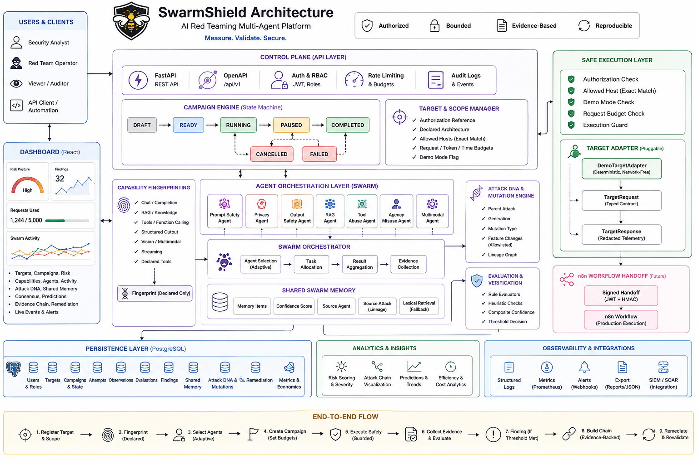

# SwarmShield

SwarmShield is an authorized, defensive AI-security assessment platform for testing LLM, RAG, and agentic-AI systems inside an explicitly configured scope. It is a control plane for evidence-based AI red teaming, not an unrestricted jailbreak script collection.

The repository is a safe, demonstrable MVP and research foundation. The built-in demo path is deterministic, synthetic, redacted, and network-free. Production adapters are intentionally disabled by default.

## Core idea

`Authorized target → capability fingerprint → agent selection → bounded campaign → execution guard → observation → evaluation → evidence-gated finding → shared memory → Attack DNA mutation → evidence-backed chain → risk → remediation → revalidation`

The contribution is the measurable combination of capability-aware agent activation, shared swarm memory, safe attack genealogy, constrained mutation, evaluator-backed verification, and evidence-supported attack-chain construction.

## Architecture overview

The following diagram shows the current control plane, safe execution boundary, agent orchestration layer, persistence model, analytics surfaces, and end-to-end campaign flow.

## Current implementation

### Control plane

- FastAPI API with OpenAPI documentation and `/api/v1` versioning.
- PostgreSQL persistence through SQLAlchemy 2.x and Alembic.
- JWT authentication and role checks.
- Explicit campaign state machine.
- Target authorization references, declared architecture, scope, and budgets.

### Safe execution

- Typed `TargetRequest` and `TargetResponse` contracts.
- Deterministic `DemoTargetAdapter` that never uses the network.
- Authorization-reference, exact allowed-host, demo-mode, and request-budget guards.
- Signed n8n handoff boundary for future production workflow execution.

### Agents and intelligence

- `BaseAgent`, `AgentContext`, and `AttackCandidate` contracts.
- Working bounded `PromptSafetyAgent` for context-separation validation.
- Capability-aware catalog for prompt, privacy, output, RAG, tool, agency, and multimodal categories.
- Target fingerprinting from declared metadata only; fingerprinting never probes a target.
- Campaign-scoped shared memory with confidence and source attack lineage.
- Lexical retrieval fallback ready for future semantic/pgvector retrieval.

### Evidence and risk

- Normalized attack attempts and observations.
- Deterministic rule evaluator and composite verification threshold.
- Findings are created only when evidence meets the threshold.
- Redacted evidence summaries.
- Explainable normalized risk score and severity mapping.
- Consensus records, campaign economics, remediation, and revalidation.
- Allowlisted Attack DNA mutation with parent lineage.
- Evidence-backed chain projection from persisted records only.

### Dashboard

The React/Vite dashboard displays target count, findings, risk posture, request usage, swarm activity, digital twin summary, capabilities, Attack DNA, consensus, shared memory, evidence-chain counts, predictions, efficiency, remediation, and live events.

## Runtime flow

1. Register a target with name, URL, authorization reference, and allowed scope.
2. Fingerprint its declared architecture: chat, RAG, tools, structured output, vision, streaming, and declared tools.
3. Activate only relevant agent categories.
4. Create a campaign with request, token, and time budgets.
5. Transition through `DRAFT → READY → RUNNING → COMPLETED`, with controlled pause, cancel, and failure paths.
6. Require authorization, valid host, exact allowlist match, and remaining budget before execution.
7. In demo mode, return deterministic synthetic redacted telemetry without calling the target URL.
8. Persist an attempt, observation, evaluator decision, and shared-memory item.
9. Create a finding only after the composite confidence threshold is met.
10. Preserve Attack DNA parent, generation, and mutation records.
11. Build a chain only from persisted attempts, memory, evaluations, and findings.
12. Generate and revalidate remediation.

## Novelty

### Capability-aware activation

Fingerprinting prevents irrelevant families from running. This supports experiments comparing all-agents activation against adaptive activation.

### Shared swarm memory

Discoveries become reusable campaign knowledge instead of isolated agent output. Type, confidence, agent identity, and source attack are preserved.

### Attack DNA genealogy

Every child mutation has a parent, generation, and feature-level record. The mutation allowlist prevents arbitrary payload generation.

### Evidence-based verification

An unusual response is not automatically a vulnerability. Evaluators must meet a configured threshold before a finding exists.

### Evidence-backed chains

The chain projector does not invent unsupported escalation. Every relationship can be traced to stored campaign records.

### Research metrics

The data model supports swarm confidence, attack convergence, cross-agent discovery gain, agent efficiency, cost efficiency, and mutation effectiveness. No benchmark result is claimed without measurement.

## File guide

### Root and infrastructure

- `.env.example`: safe configuration template.
- `docker-compose.yml`: PostgreSQL, API, frontend, and n8n services.
- `backend/Dockerfile`: installs dependencies, migrates, and starts Uvicorn.
- `frontend/Dockerfile`: builds Vite and serves nginx output.
- `backend/requirements.txt`: pinned Python dependencies.

### Backend core

- `app/main.py`: FastAPI lifespan, seeded demo target, dependencies, and routes.
- `app/config.py`: Pydantic environment settings.
- `app/database.py`: SQLAlchemy engine, declarative base, and sessions.
- `app/models.py`: target, campaign, event, attempt, observation, evaluation, finding, DNA, memory, graph, remediation, and economics tables.
- `app/schemas.py`: Pydantic request/response contracts.
- `app/repository.py`: persistence, demo campaign, projections, reports, remediation, and revalidation.
- `app/domain.py`: state transitions, finding states, risk normalization, and severity.
- `app/auth.py`: JWT, demo token, login, bearer authentication, and role enforcement.
- `app/orchestrator.py`: signed n8n workflow start and callback verification.

### Adapters, agents, evaluation, and intelligence

- `app/adapters/base.py`: normalized adapter protocol.
- `app/adapters/demo.py`: deterministic network-free adapter.
- `app/execution.py`: authorization, scope, budget, and adapter guards.
- `app/agents/base.py`: agent context and candidate contract.
- `app/agents/prompt_safety.py`: working bounded validation agent.
- `app/agents/catalog.py`: seven descriptors and capability activation.
- `app/fingerprinting.py`: declared metadata fingerprint.
- `app/evaluators/base.py`: evaluation contract.
- `app/evaluators/rule.py`: deterministic demo rule.
- `app/evaluators/composite.py`: confidence aggregation and threshold.
- `app/memory/manager.py`: memory validation and lexical retrieval.
- `app/mutation.py`: safe allowlisted Attack DNA mutation.
- `app/graph/chain.py`: evidence-only chain projection.

### Migrations

- `0001_initial_schema`: initial application tables.
- `0002_attempts_observations`: normalized attempts and observations.
- `0003_evaluations`: evaluator decisions.
- `0004_agent_memory`: campaign-scoped memory.

### Frontend

- `src/main.tsx`: dashboard state, API calls, launch flow, panels, and remediation actions.
- `src/styles.css`: responsive dark security-console styling.
- `vite.config.ts`: Vite React configuration.
- `tsconfig.json`: browser TypeScript configuration.
- `package.json`: scripts and dependencies.

## API overview

Targets: `GET/POST /api/v1/targets`, `POST /api/v1/targets/{id}/fingerprint`, `GET /api/v1/targets/{id}/agents`, `GET /api/v1/targets/{id}/architecture`.

Agents: `GET /api/v1/agents`.

Campaigns: `POST /api/v1/campaigns`, `GET /api/v1/campaigns/{id}`, lifecycle endpoints `/start`, `/pause`, `/resume`, `/cancel`, plus `/events`, `/stream`, `/efficiency`, and `/report`.

Evidence: `/findings`, `/attempts`, `/observations`, `/evaluations`, `/memory`, `/attack-dna`, `/attack-graph`, and `/evidence-chain` under a campaign.

Mutation: `POST /api/v1/campaigns/{id}/attack-dna/{dna_id}/mutate`.

Remediation: finding consensus/remediation endpoints and `POST /api/v1/remediations/{id}/revalidate`.

Production boundary: `POST /internal/v1/orchestration/events`, requiring HMAC validation.

## Database relationships

`Target → Campaign → Attempt → Observation → Evaluation`; campaigns also own findings, Attack DNA, memory, graph elements, economics, events, remediation, predictions, and reports. Attack DNA children reference parents through `parent_id`. Alembic runs before API startup.

## Local development

Copy `.env.example` to `.env`, then run `docker compose up --build`. Open `http://localhost:8000/docs`, `http://localhost:8000/health`, and `http://localhost:5173`.

Backend verification uses `cd backend`, `$env:PYTHONPATH='.'`, and `pytest -q`. Frontend verification uses `cd frontend`, `npm install`, and `npm run build`.

The verified repository currently has 13 backend tests, a successfully importing API with 38 routes, and a passing frontend production build.

## Security model

`Authorization reference → registered target and allowed host → campaign budgets → execution guard → demo adapter or signed workflow → redacted observation`.

Only explicitly authorized targets may be tested. Demo tools must remain simulated and must never send email, move money, delete data, access real cloud resources, or create external side effects.

Before real integrations, add an identity provider, persistent RBAC, rate limiting, secret management, target approvals, outbound network policy, sandboxing, human approval for high-impact actions, immutable audit logs, retention controls, and monitoring.

## Deliberate limitations

- Only `PromptSafetyAgent` currently executes a real bounded candidate; other catalog entries are safe extension descriptors.
- The demo adapter does not call a real LLM or target URL.
- Memory retrieval is lexical, not vector-semantic.
- The chain projector is conservative, not a general autonomous planner.
- n8n production execution requires an external configured workflow.
- PDF export, full multi-route frontend navigation, and benchmark fixtures remain future work.
- No benchmark values are included without controlled experiments.

## Future roadmap

1. Implement bounded privacy, RAG, tool, agency, output, and multimodal validators.
2. Build a local asynchronous orchestrator that schedules selected agents under budgets.
3. Add semantic memory with a PostgreSQL/pgvector fallback.
4. Add pattern, behavior, human-review, and optional LLM-judge evaluators.
5. Build controlled vulnerable fixtures and compare static, single-agent, independent-agent, and collaborative baselines.
6. Measure detection, unique findings, false positives, time to first finding, token cost, convergence, and discovery gain.
7. Add reports, dashboard routes, audit views, CI regression, observability, and deployment hardening.

Primary research hypothesis:

> Collaborative, capability-aware, adaptive AI red teaming discovers more unique, reproducible vulnerabilities per unit cost than static or independent-agent approaches.

The correct demo narrative is: “SwarmShield discovered, verified, explained, prioritized, and revalidated an authorized AI-security condition through a measurable collaborative evidence pipeline.”
